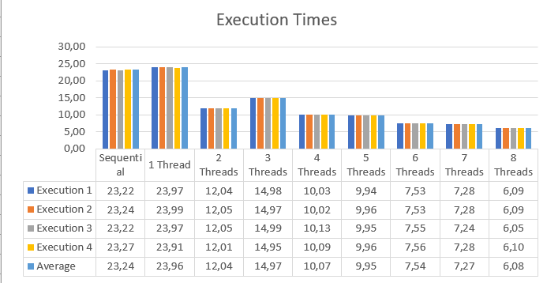
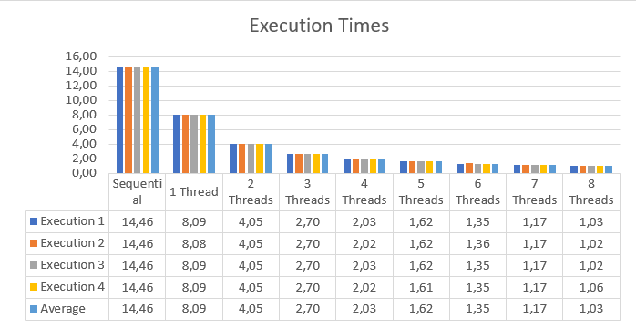

# Solutions for Assignment 2

The goal of this assignment is to get a first grasp of performance-oriented programming. Furthermore, you will be using the LCC2 cluster, `cachegrind`, and `perf` for the first time in this lab.

## Exercise 1 (1 Point)

### Description

Maybe you have already heard of **Fractals** or **Mandelbrot**. [Fractals](https://en.wikipedia.org/wiki/Fractal) are geometric patterns that appear to be infinitely detailed. There are many [functions](https://en.wikipedia.org/wiki/List_of_fractals_by_Hausdorff_dimension) that can generate such patterns. The more often you evaluate these functions, the more detailed the pattern becomes. 

This task will focus on the [Mandelbrot set](https://en.wikipedia.org/wiki/Mandelbrot_set), a set of complex numbers that is generated by the function *z<sub>n+1</sub>=z<sub>n</sub><sup>2</sup>+c*, where *z* is a complex number and *c* is a constant. 
> Short reminder: a complex number *z* is the sum of a real part *x* and an imaginary part *y* that includes the imaginary unit *i* with the property (*i<sup>2</sup>=-1*) &rarr; *z=x+yi*.


Since the exact math behind this is not that important to us, we will provide you with a pseudocode:

```
function calc_mandelbrot(image): 
    for each (X,Y) do:
        x = 0.0
        y = 0.0
        cx = mapped x_pixel_idx to Mandelbrot x-axis [-2.5, 1]
        cy = mapped y_pixel_idx to Mandelbrot y-axis [-1, 1]
        iteration = 0
        while (x*x + y*y <= 2*2 AND iteration < MAX_ITER) do:
            x_tmp = x*x - y*y + cx
            y = 2*x*y + cy
            x = x_tmp
            iteration = iteration + 1

        norm_iteration = mapped iteration to pixel range [0, 255]
        image[x_pixel][y_pixel] = norm_iteration
```

### Tasks

- Open the `mandelbrot.c` file and implement the sequential `calc_mandelbrot` function with the help of the provided pseudocode.
- Check out the generated image `mandelbrot.png` to see if you implemented the algorithm correctly. 
- Benchmark your program on the LCC2 cluster, document your results and add them to the comparison spreadsheet linked on Discord. How would you improve program performance?
- Can you think of a way to parallelize this algorithm?
    We can just parallelize the outer for loop using `#prage omp for`  
    It should not be necessary to implement a critical region / atomics even if all threads work  
    on the same array, because they should not write / read from the same memory location.


### Solution
  
The serial algorithm took a mean of 23.24 seconds. A method to improve it, would be to parallelize it. We can parallelize the for loop easily because every pixel gets calculated independently from the other ones.						

## Exercise 2 (1 Point)

### Description

The Hadamard product is defined as the element-wise product of two matrices with the same dimensions. The following two snippets give an implementation of the Hadamard product for n x n square matrices.

```C
for (size_t i = 0; i < n; ++i) {
    for (size_t j = 0; j < n; ++j) {
        c[i][j] = a[i][j] * b[i][j];
    }
}
```

```C
for (size_t j = 0; j < n; ++j) {
    for (size_t i = 0; i < n; ++i) {
        c[i][j] = a[i][j] * b[i][j];
    }
}
```

### Tasks

- For both implementations, give a function f to calculate the number of data cache read misses for the matrix size n and the cache line size s in an 8-way set-associative cache. Assume that all variables are initialized appropriately (the matrix elements are of type `int32_t`) and that the matrices are stored in contiguous memory in row-major order. Additionally, the matrices are too large to store them entirely in the cache (n >> s).
- Use the two snippets to implement two versions of the Hadamard product.
- Log into the LCC2 cluster and analyze the cache behavior of the implementations using `cachegrind` and `perf`. Can you validate your theoretical findings? Compare the results of both tools.

### Solution
"Snippet 1:
We are iterating over the matrix in the way it is located in the memory. So the algorithm caches the first value of the matrix + (s/4) - 1 values since a cache line is as bis as s/sizeof(int32_t) = s/4.
So we can we have cache miss for every s'th byte. So with one matrix the following forumla holds:
 
Since the snippet loops over two matrices we have simply twice as much cache misses


Snippet 2:
Since n>>s/4 and we are traversing first over the columns we will never have a cache hit, assuming the cache isnt big enough to store more than n cachelines. So the forumla is:


Cachegrind simulates cache so it is more a theoretical simulation than a practical measurement, and it says with a N*N Matrix that we have 126488 misses in the first snippet, and 2000492 in the second one. So it looks like that the first snippet is better. This gets proved by perf, perf measures the cache-misses so its more accurate and there we have 2161 respectively 59075 misses. It looks like some optimation is going on in the background since the real numbers are lower than the theoretical ones. It is hard to check if the forumlas are valid, because we dont know the cache-line size. The cachegrind result for the second snippet is almost the same as the forumula.

## Exercise 3 (1 Point)

### Description

There are several methods to approximate Pi numerically. In this exercise, you are asked to approximate Pi using the Monte Carlo method. Therefore, n (n >> 1) random 2D points equally distributed in the interval [0, 1] x [0, 1] are generated, and it is checked whether they are inside the first quadrant of a unit circle. Let i be the number of points that lie inside the quarter of the unit circle. Then Pi can be approximated by 4 \* i / n.

### Tasks

- Implement a serial version of Monte Carlo Pi approximation.
- Implement a parallel version of Monte Carlo Pi approximation using POSIX Threads Library (`pthread`).
- Benchmark the sequential version and the parallel version for 1 to 8 threads on LCC2 using n = 500,000,000. Document your results and visualize them in appropriate figures. How could you improve program performance?
- with and without -O3 serial algorithm average of 5 trials 14.9s
- Add your measured execution times for 1 and 8 threads on LCC2 to the comparison spreadsheet linked on Discord.

## General Notes

All the material required by the tasks above (e.g., code, figures, text, etc...) must be part of the solution that is handed in. Your experiments should be reproducible and comparable to your measurements using the solution materials that you hand in.

**Every** member of your group must be able to explain the given problem, your solution, and possible findings. You may also need to answer detailed questions about any of these aspects.

### Solution

The sequential version has an average execution time of 14,46 seconds while the parallel version using pthread has the lowest runtime with 8 threads of 1,03s. So parallelizing has quite a lot impact on the approximation of pi using the Monte Carlo method.


