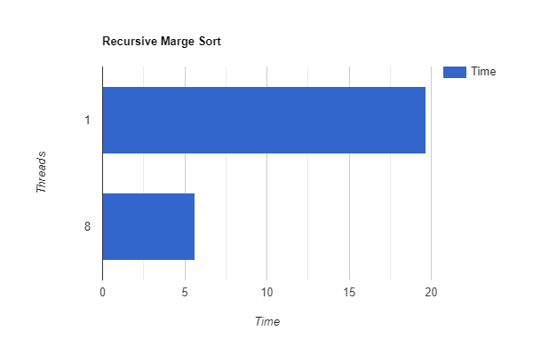

# Assignment 4 for April 20th, 2021

The goal of this assignment is to gain more experience in parallelizing programs with OpenMP.


## Exercise 1 (1 Point)

### Description

This exercise consists of exploring the effects of OpenMP thread affinity.    

### Tasks

- Write an OpenMP program that atomically increments an `int` in a parallel loop for a large number of iterations, i.e. such that the program takes at least 2 seconds to execute. Have the program print the time required to process the entire loop. Compile your program with gcc 8.2.0 and optimization level `-O3`.
- Run your program with 4 threads. Explore the affinity features of OpenMP 4.0 to change the way threads are mapped to cores, e.g. using a single CPU only or using both CPUs. Explain the affinity settings that you chose.
- Benchmark your program with these affinity settings. What can you observe?

## Exercise 2 (1 Point)

### Description

This exercise deals with the OpenMP flush directive and why it can be necessary.

### Tasks

- Examine [flush.c](flush.c) and explain what the code does from an abstract, high-level perspective. What should happen here?
    - Thread 1 writes a Variable and then tells Thread 2 to print it out.
- Compile this code with with gcc 8.2.0 and optimization level `-O3`. Run it in an interactive job (e.g. using `qrsh -pe openmp 8`) in a loop many times (e.g. write a loop in bash that executes it 1000 times). Run this loop repeatedly. What can you observe? **Note: Please quit your interactive job once you are done!**
    - At some point of Time, the execution of run.sh gets stuck. Probably because the second thread reads "flag" from its cache or the first thread only writes to its cache.
- Does this code require any `#pragma omp flush` directives? If it does, where are they necessary? If it does not, why not?
    - Yes this code requires some flush operations, in order to insure that data is written bevore flag and flag gets read from the main memory.
    ```cpp
    if (omp_get_thread_num()==0) {
         /* Write to the data buffer that will be read by thread */
         data = 42;
         #pragma omp flush(data)
         /* Set flag to release thread 1 */
         flag = 1;
         #pragma omp flush(flag)
      }
      else if (omp_get_thread_num()==1) {
         /* Loop until we see the update to the flag */
         #pragma omp flush(flag)
         while (flag < 1) {
            #pragma omp flush(flag)
         }
         /* print flag and data */
         #pragma omp flush(data)
         printf("flag=%d data=%d\n", flag, data);
      }
    ```

## Exercise 3 (1 Point)

### Description

In this exercise, you will improve your implementation of merge sort.

### Tasks

- Write a recursive implementation of your merge sort algorithm of the last assignment.
- Provide both a sequential and a parallel version of the recursive implementation.
- Explain the OpenMP constructs you used for parallelization.
```c
// create a parallel region
#pragma omp parallel
	{
// execute this reguion with the master thread
#pragma omp master
		mergesort_parallel_omp(a, SIZE, temp);
	}
```

```c
// Task: dynamically created independent piece of work executed asynchronously
void mergesort_parallel_omp(int32_t a[], int32_t size, int32_t temp[]) {
	if(size < 75000) {
		mergesort_serial(a, size, temp);
		return;
	}

	int32_t sizeH = size / 2;

// use taskgroup for deep sync of child tasks
#pragma omp taskgroup
	{
// define tasks
#pragma omp task
		mergesort_parallel_omp(a, sizeH, temp);
#pragma omp task
		mergesort_parallel_omp(a + sizeH, size - sizeH, temp + sizeH);
	}

	merge(a, size, temp);
}
```

- How does the performance of the recursive version compare to the iterative version, both sequential and parallel?

| Recursive        | Iterative | 
| ------------- |:-------------:| 
| | | 

## General Notes

All the material required by the tasks above (e.g., code, figures, text, etc...) must be part of the solution that is handed in. Your experiments should be reproducible and comparable to your measurements using the solution materials that you hand in.

**Every** member of your group must be able to explain the given problem, your solution, and possible findings. You may also need to answer detailed questions about any of these aspects.
